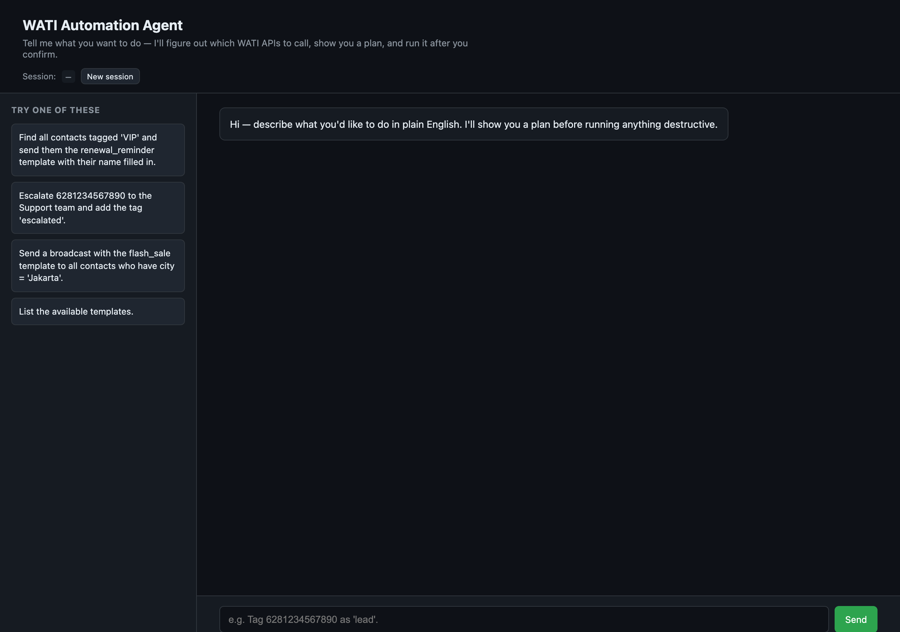
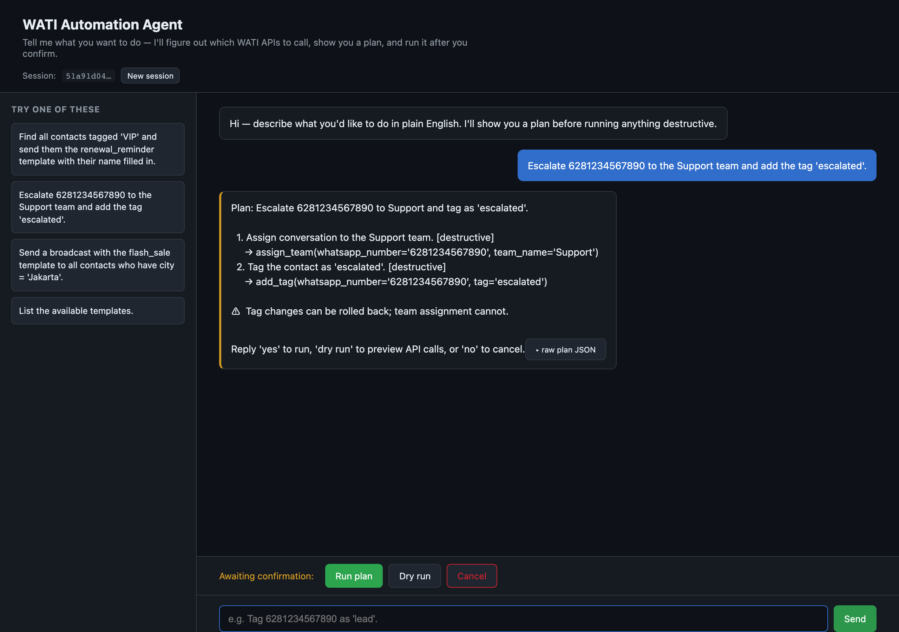
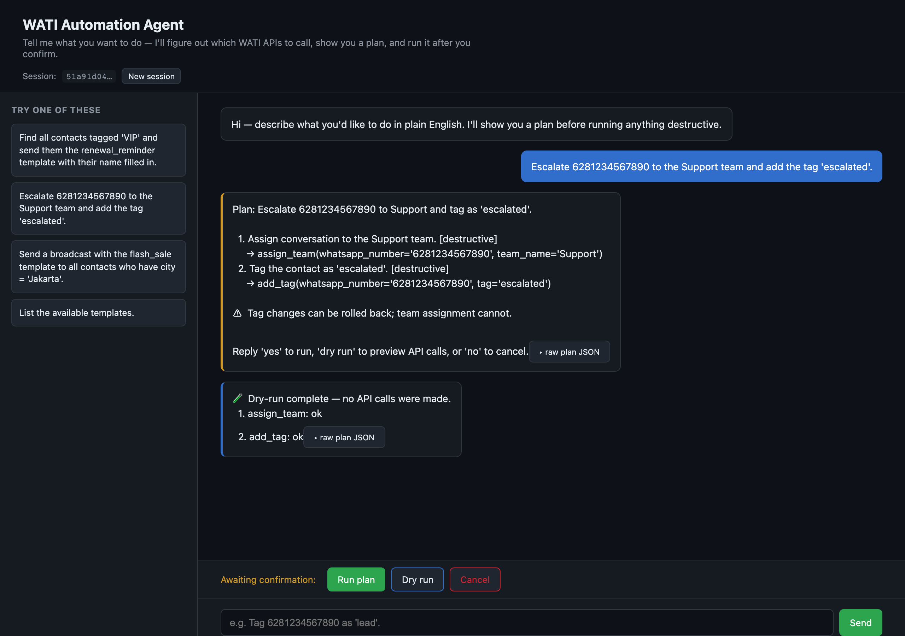
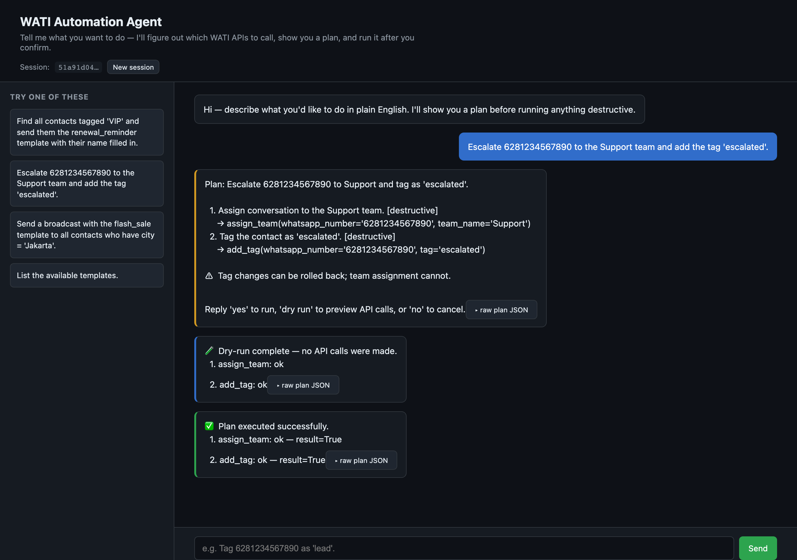
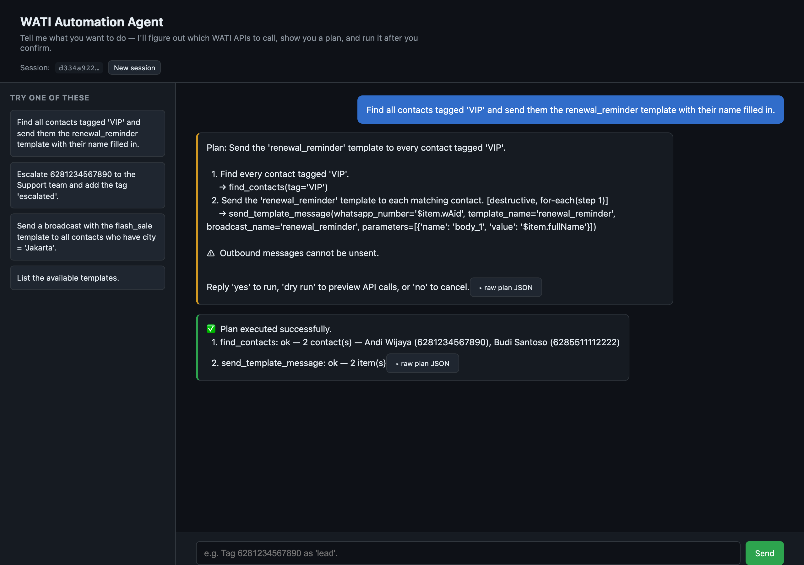
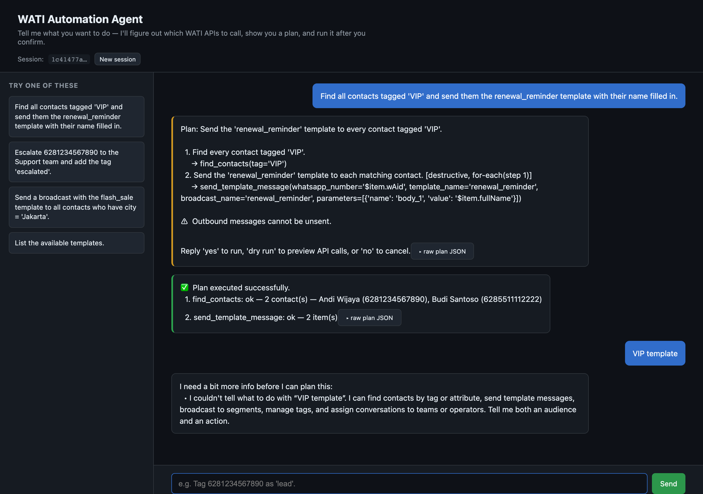

# WATI Automation Agent

A lightweight AI agent that turns plain-English instructions into a sequenced
plan of WATI WhatsApp Business API calls, previews the plan, asks for
confirmation, and executes — with rollback on failure.

> *"Find all VIP contacts and send them the renewal_reminder template with
> their name."* → 2 API calls, with preview + confirm + rollback baked in.

```
┌────────────┐    ┌──────────┐    ┌──────────┐    ┌─────────────┐
│ User input │ ─▶ │  Planner │ ─▶ │ Executor │ ─▶ │ WatiClient  │
│  (NL)      │    │  (LLM)   │    │ (deterministic)│ (mock|real) │
└────────────┘    └──────────┘    └──────────┘    └─────────────┘
                       │                ▲
                       └──── memory ────┘
```

See [`docs/ARCHITECTURE.md`](docs/ARCHITECTURE.md) for the full design and
[`docs/BUILD_NOTES.md`](docs/BUILD_NOTES.md) for trade-offs and the V2 roadmap.

## What it can do

| Domain | Tools |
| --- | --- |
| Contacts | `find_contacts`, `get_contact`, `add_contact`, `update_contact_attributes` |
| Tags | `add_tag`, `remove_tag` (invertible) |
| Messages | `send_session_message`, `send_template_message` |
| Templates | `list_templates` |
| Broadcasts | `send_broadcast` |
| Operators & tickets | `list_operators`, `assign_operator`, `assign_team` |

The agent will:

* **Plan** — LLM produces a structured plan (list of tool calls, possibly
  iterating over a previous step's output, e.g. "for each VIP contact").
* **Clarify** — if a required parameter is missing, it asks instead of guessing.
* **Preview** — destructive plans require confirmation. `dry run` shows what
  would happen without sending anything.
* **Execute** — runs steps in order, halts on first failure.
* **Roll back** — invertible steps (tag changes) are undone automatically when
  a later step fails. Irreversible actions (sent messages) are flagged in the
  preview so the user knows the risk before confirming.

## Quick start

```bash
# 1. install
python3 -m venv .venv
source .venv/bin/activate
pip install -e ".[dev]"

# 2. (optional) configure
cp .env.example .env
# edit .env to set LLM_PROVIDER + LLM_API_KEY (see "Configuration" below),
# or run with WATI_AGENT_LLM=fake to use the rule-based offline planner

# 3a. CLI
wati-agent chat
# 3b. web UI
wati-agent serve  # then open http://127.0.0.1:8000

# 4. tests
pytest
```

No API key? The agent falls back to a rule-based `FakePlanner` that handles
the assignment's three example instructions plus a few obvious extensions —
useful for development, CI, and offline demos.

## Demo (web UI)

A walk-through of the chat UI on the `mock` backend. The same six steps cover
every product feature: planning, preview, dry-run, confirmed execution,
iteration over a previous step's output, and context-aware clarification.

### 1. Open the chat UI
Plain English in, plan out — nothing has happened yet.



### 2. Plan preview before any destructive run
Type *"Escalate 6281234567890 to the Support team and add the tag 'escalated'."*
The agent produces a 2-step plan, flags both steps `[destructive]`, surfaces
the rollback caveat, and waits for explicit confirmation.



### 3. Dry run — read-only steps run, destructive ones are simulated
Click **Dry run**. Each step reports `ok` but no side effects fire; the
confirmation bar stays so the user can still hit **Run plan**.



### 4. Confirmed execution
Click **Run plan**. The plan executes top-to-bottom; the report shows what
each tool returned. The confirmation bar disappears.



### 5. Iteration — find contacts then act on each
*"Find all contacts tagged 'VIP' and send them the renewal_reminder template
with their name filled in."* The plan uses `for_each` to send the template
once per matching contact. The execution report includes the actual contact
names — both for the user and for the LLM's next turn.



### 6. Context-aware clarification
Follow up with an ambiguous *"VIP template"*. The agent quotes the user's
exact phrase and asks specifically what's missing — repeating an ambiguous
input in a different wording will not produce an identical reply.



## Example session (CLI)

```
you ▸ Find all contacts tagged 'VIP' and send them the renewal_reminder template with their name.
agent · plan_preview ─────────────────────────────────────────────
Plan: Send the 'renewal_reminder' template to every contact tagged 'VIP'.

  1. Find every contact tagged 'VIP'.
     → find_contacts(tag='VIP')
  2. Send the 'renewal_reminder' template to each matching contact. [destructive, for-each(step 1)]
     → send_template_message(whatsapp_number='$item.wAid', ...)

⚠  Outbound messages cannot be unsent.

Reply 'yes' to run, 'dry run' to preview API calls, or 'no' to cancel.
─────────────────────────────────────────────────────────────────
you ▸ dry run
agent · execution ────────────────────────────────────────────────
🧪 Dry-run complete — no API calls were made.
  1. find_contacts: ok — 2 contact(s)
  2. send_template_message: ok
─────────────────────────────────────────────────────────────────
you ▸ yes
agent · execution ────────────────────────────────────────────────
✅ Plan executed successfully.
  1. find_contacts: ok — 2 contact(s)
  2. send_template_message: ok
─────────────────────────────────────────────────────────────────
```

## Configuration

All config is via environment variables (see `.env.example`):

### LLM (multi-provider)

| Var | Default | Notes |
| --- | --- | --- |
| `LLM_PROVIDER` | `anthropic` | `anthropic` or `openai` (the latter covers any OpenAI-compatible endpoint — see below). |
| `LLM_API_KEY` | – | API key for the chosen provider. Falls back to `ANTHROPIC_API_KEY` / `OPENAI_API_KEY` if unset. |
| `LLM_BASE_URL` | – | Optional custom endpoint (only used by `openai`). |
| `LLM_MODEL` | provider default | `claude-sonnet-4-6` for anthropic, `gpt-4o-mini` for openai. |
| `WATI_AGENT_LLM` | `real` | `real` or `fake` (rule-based, runs offline). |

### WATI

| Var | Default | Notes |
| --- | --- | --- |
| `WATI_AGENT_BACKEND` | `mock` | `mock` (in-memory, seeded) or `real` (HTTP). |
| `WATI_TENANT_ID`, `WATI_API_TOKEN`, `WATI_BASE_URL` | – | Required when `WATI_AGENT_BACKEND=real`. |

### Switching LLM providers

The `openai` provider isn't tied to OpenAI — anything that speaks the
OpenAI chat-completions tool-calling API works:

```bash
# OpenAI
LLM_PROVIDER=openai
LLM_API_KEY=sk-...
LLM_MODEL=gpt-4o-mini

# DeepSeek
LLM_PROVIDER=openai
LLM_API_KEY=sk-...
LLM_BASE_URL=https://api.deepseek.com/v1
LLM_MODEL=deepseek-chat

# Moonshot (Kimi)
LLM_PROVIDER=openai
LLM_API_KEY=sk-...
LLM_BASE_URL=https://api.moonshot.cn/v1
LLM_MODEL=kimi-k2-0905-preview

# Local Ollama (no API key required by the server, but the SDK demands one)
LLM_PROVIDER=openai
LLM_API_KEY=ollama
LLM_BASE_URL=http://localhost:11434/v1
LLM_MODEL=llama3.1

# Native Claude (default)
LLM_PROVIDER=anthropic
LLM_API_KEY=sk-ant-...
LLM_MODEL=claude-sonnet-4-6
```

The agent core never sees the provider — `LLMBackend` is a single interface
with two implementations behind it.

## Repo layout

```
src/wati_agent/
  agent/         planning, execution, tool registry, memory
    schemas.py     Pydantic models (Plan, Step, ExecutionReport)
    tools.py       tool registry — single source of truth
    planner.py     LLM + rule-based planners
    executor.py    plan runner with dry-run + rollback
    memory.py      per-session conversation history
    core.py        Agent — public façade (chat / confirm / reset)
  wati/          API client layer
    client.py      abstract base + factory
    mock_client.py in-memory backend
    real_client.py httpx-based backend
  server.py      FastAPI app
  cli.py         typer CLI
  config.py      env-based settings
frontend/        chat UI (vanilla HTML/CSS/JS)
tests/           pytest suite (83 tests)
docs/            ARCHITECTURE.md, BUILD_NOTES.md, img/ (demo screenshots)
```

## API endpoints (when serving)

* `POST /api/chat` — `{message, session_id?}` → plan / preview / execution
* `POST /api/confirm` — `{session_id, action: run|dry_run|cancel}`
* `POST /api/reset?session_id=…`
* `GET  /api/health`

OpenAPI docs at `/docs`.

## WATI API mapping

The agent plans in terms of tools, and each tool maps to one documented WATI
API operation. The mock backend implements the same client interface as the
real HTTP backend, so the execution layer does not change when switching from
demo data to sandbox credentials.

| Agent tool | WATI API operation | Notes |
| --- | --- | --- |
| `find_contacts` | `GET /api/v1/getContacts` | Supports pagination, tag filtering, and client-side custom attribute filtering. |
| `get_contact` | `GET /api/v1/getContactInfo/{whatsappNumber}` | Returns one contact or `None` when not found. |
| `add_contact` | `POST /api/v1/addContact/{whatsappNumber}` | Creates a contact with optional `customParams`. |
| `update_contact_attributes` | `POST /api/v1/updateContactAttributes/{whatsappNumber}` | Mutates `customParams`; previous values are not snapshotted in V1. |
| `add_tag` | `POST /api/v1/addTag/{whatsappNumber}` | Invertible via `remove_tag`. |
| `remove_tag` | `DELETE /api/v1/removeTag/{whatsappNumber}/{tagName}` | Invertible via `add_tag`. |
| `send_session_message` | `POST /api/v1/sendSessionMessage/{whatsappNumber}` | Irreversible outbound message. |
| `send_template_message` | `POST /api/v2/sendTemplateMessage/{whatsappNumber}` | Uses v2-style body parameter names such as `body_1`. |
| `list_templates` | `GET /api/v1/getMessageTemplates` | Used for template discovery before planning or execution. |
| `send_broadcast` | `POST /api/v1/sendBroadcastToSegment` | Sends a template broadcast to an existing WATI segment. |
| `list_operators` | `GET /api/v1/getOperators` | Supports common response shapes from the real API and mock backend. |
| `assign_operator` | `POST /api/v1/assignOperator/{whatsappNumber}` | Assigns a conversation to a specific human operator. |
| `assign_team` | `POST /api/v1/tickets/assign` | Assigns or routes the contact conversation to a team. |

Real WATI credentials are not included in the assignment PDF. To use the real
backend, set `WATI_AGENT_BACKEND=real`, `WATI_TENANT_ID`, and `WATI_API_TOKEN`.

## Tests

```bash
pytest                      # 83 tests, 79% coverage
pytest --cov=wati_agent     # full coverage report
```

Test surfaces:

* `test_mock_client.py` — backend behaviour, error paths, simulated failures.
* `test_tools.py` — registry dispatch, schema generation, inverses.
* `test_executor.py` — placeholder resolution, iteration, dry-run, rollback,
  error propagation, skipped steps.
* `test_planner.py` — rule-based pattern matching + LLM-fallback wiring.
* `test_llm.py` — LLM backend abstraction, factory, planner ↔ backend wiring.
* `test_config.py` — env var resolution and backwards-compat fallbacks.
* `test_memory.py` — turn truncation + reset.
* `test_agent.py` — full conversation flows: clarification, preview, confirm,
  cancel, dry-run, new-instruction-replaces-pending.
* `test_real_client.py` — real-client response-shape handling without live credentials.
* `test_server.py` — HTTP layer via `TestClient`.

## Disclaimer

The mock client mirrors the WATI API surface from the assignment spec but is
not a faithful reproduction of every edge case. The real client follows the
documented endpoints; live API differences may need small tweaks in
`real_client.py`.
